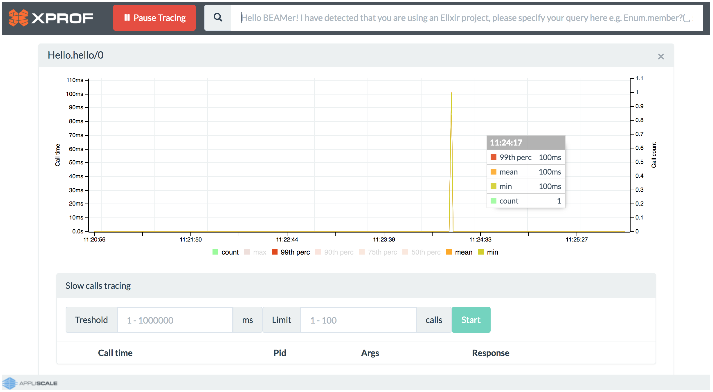
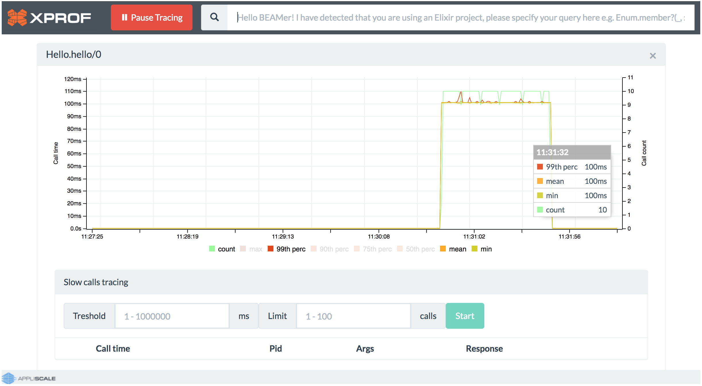
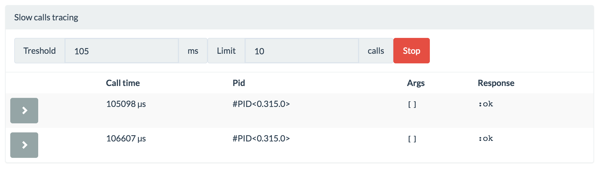

# How to XProf

This guide will help you get started and acquainted with XProf. After this short tutorial, you will have enough knowledge to profile your production app.

## Elixir

Let's imagine that we have simple Elixir module containing two functions. First `Hello.hello/0` just print us "Hello world!" and wait 100ms where second `Hello.say_hello/0` is invoking `Hello.hello/0` 600 times (Source code is available on GitHub - [link](https://github.com/Appliscale/hello_xprof_elixir)). We built the application with [Mix](https://elixir-lang.org/getting-started/mix-otp/introduction-to-mix.html) as Elixir build tool.
Our logic is inside `lib/hello.ex`:

```elixir
defmodule Hello do
  def hello do
    IO.puts "Hello, world!"
    Process.sleep(100)
  end

  def say_hello do
    Enum.each(
      1..600,
      fn(_) ->
        hello()
      end)
  end
end
```

To add XProf as dependency find `mix.exs` which is configuration file and add to `deps` function new entry. At the time of writing, version 1.2.2 is the newest.

```elixir
defp deps do
  [
    ...
    {:xprof, "~> 1.2.2"}
  ]
end

```
We want to check whether execution of `Hello.hello/0` function is fast. Doesn't really execute 10 times per second when invoked by `Hello.say_hello/0`? Let's find out! Before we check it we need to download all Hex dependencies by typing in CLI:

```
$ mix deps.get
``` 

and next compile our app with:

```
$ mix compile
```

Once the project is compiled, you can start an iex session inside the project by running:

```
$ iex -S mix
```

Let's load our module in Elixir’s Interactive Shell so that XProf sees this module.

```iex
iex(1)> l Hello
{:module, Hello}
```

Now we can start XProf.

```iex
iex(2)> :xprof.start
{:ok, []}
```

Go to `http://localhost:7890` in your browser. Let's type `Hello.hello/0` in the search box and press enter. Note that you can use here autocompletion feature (Tab, up, down and enter).


Xprof will start tracing and show a time graph. For know, we have zero values because our `Hello.hello/0` function isn't invoked by anyone. Go back to iex and invoke it.

```iex
iex(3)> Hello.hello
Hello, world!
:ok
```

We should receive one peak on the graph.



Let's experiment a little bit more. Return to iex session, but don't close XProf. Our module consist `Hello.say_hello/0` function which should invoke `Hello.hello/0` 600 times (for 10 seconds).

```
iex(4)> Hello.say_hello
Hello, world!
Hello, world!
Hello, world!
...
```

Return to the browser and you should be able to observe the behaviour of `Hello.hello/0`. Move mouse over to see the tooltip. Each new point represents 1 second. By default, you will see count (call count scale on the right), max, 99th percentile, mean and min values (call time scale on the left). Other options available are 90th, 75th, 50th percentile. You can select which lines you are interested in selecting them on the bottom of the graph.



In theory, each execution should take 100ms (plus unnoticeable time for printing "Hello, world!"). As you can see I got few execution which took almost 110ms.
You can trace slow calls using tracer below graph. In Threshold input, we can type 105 (threshold in milliseconds), in Limit input 10 (number of calls to catch) and click Start. For my case, 2 calls have been caught which is ilustrated by screenshot below (Notice: It was different run than shown on previous graph). 



To stop tracing `Hello.hello` click on "x" button in the upper right corner or click on "Pause Tracing" button which will stop tracing all function. Yes, you can trace more than one function at the time.

## Erlang

Now let's try to use XProf for Erlang application (Source code is available on GitHub - [link](https://github.com/Appliscale/hello_xprof_erlang)). We will use [rebar3](http://www.rebar3.org/docs/basic-usage) as Erlang's build tool. To initialize project we will use the following command:

```
$ rebar3 new app hello
```

Let's use a similar example as we used for Elixir quick start. In `hello_app` module we defined and exported `hello_app:hello/0` and `hello_app:say_hello/0` functions. They are located inside `src/hello_app.erl`

```erlang
-module(hello_app).
-behaviour(application).
-export([start/2, stop/1, hello/0, say_hello/0]).
...
hello() ->
    io:format("~s~n", ["Hello, world!"]),
    timer:sleep(100).

say_hello() ->
    lists:foreach(
        fun(X) ->
            hello()
        end,
        lists:seq(1, 600)).
```

To add XProf as dependency find `rebar.config` configuration file and add to `deps` new entry. At the time of writing, version 1.2.2 is the newest.

```erlang
{deps, [
    {xprof, "1.2.2"}
    ]}.
```

Now let's compile our simple application (XProf dependecy will be downloaded at this step).

```
$ rebar3 compile
```

Use rebar3 to start an Erlang shell with our app.

```
$ rebar3 shell
```

In the shell we need start our application and XProf.

```
Eshell V9.1.1  (abort with ^G)
1> application:start(hello).
ok
2> xprof:start().
15:33:27.189 [info] Application lager started on node nonode@nohost
15:33:27.190 [info] Application jsone started on node nonode@nohost
15:33:27.191 [info] Application customized_hdr_histogram started on node nonode@nohost
{ok,[ranch,cowlib,cowboy,syntax_tools,compiler,goldrush,
     lager,jsone,customized_hdr_histogram,xprof]}
```

Go to `http://localhost:7890` in your browser. Let's type `hello_app:hello/0` in the search box and press enter. XProf will start tracing. Return to the Erlang shell and invoke `hello_app:hello/0` function.

```
3> hello_app:hello().
Hello, world!
ok
```

We should be able to see the execution of the function on a time graph. Let's invoke `hello_app:say_hello()`, the function will execute `hello_app:hello()` 600 times.

```
4> hello_app:say_hello().
Hello, world!
Hello, world!
...
```

Go back to the browser and enjoy investigation!
